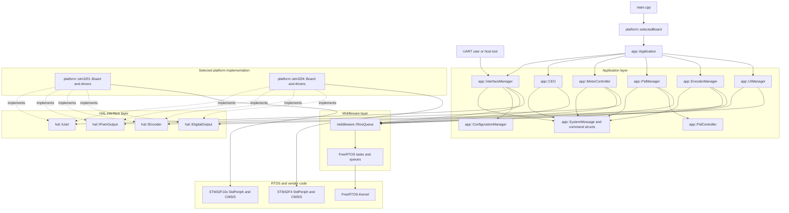
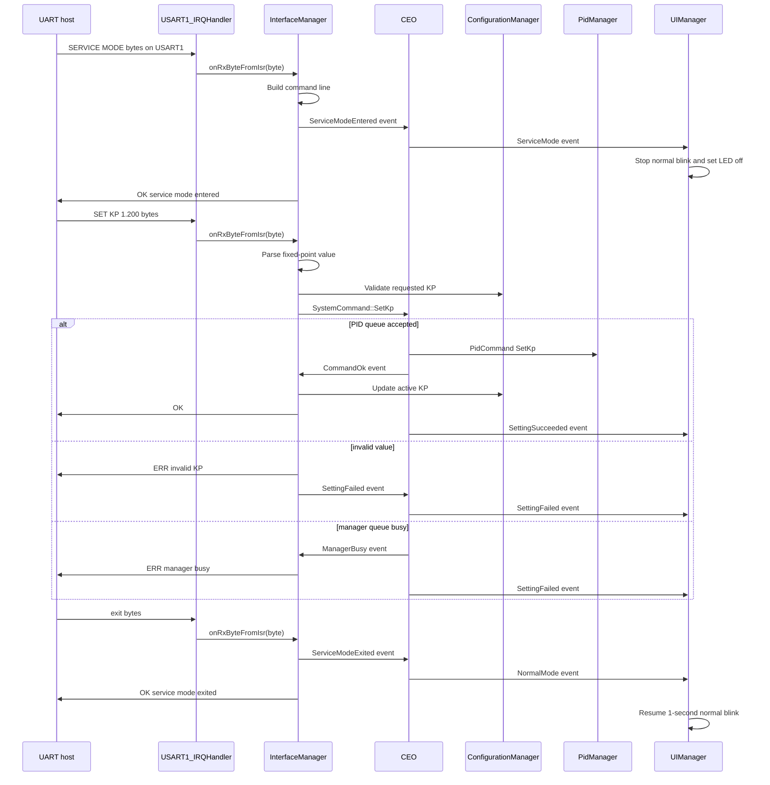
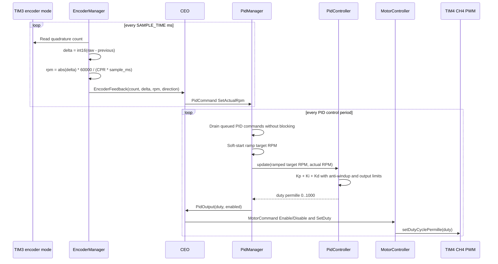
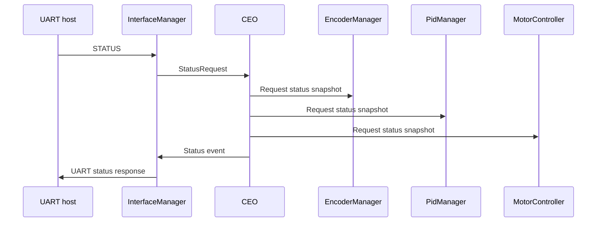
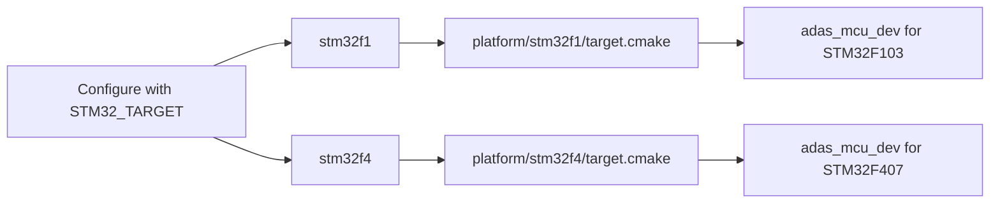

# STM32 RTOS C++ Architecture

## Layers

The firmware is now split into explicit ownership layers:

| Layer | Folder | Responsibility |
| --- | --- | --- |
| Application | `src/app` | RTOS managers, service-mode command parsing, runtime configuration, encoder feedback, PID speed control |
| Middleware | `include/middleware` | Small FreeRTOS wrappers used by application classes |
| HAL interfaces | `include/hal` | C++ contracts for UART, PWM duty output, encoder, GPIO output, hardware components |
| Platform | `platform/stm32f1`, `platform/stm32f4` | Chip-specific startup, linker, StdPeriph/CMSIS setup, concrete peripheral drivers |
| RTOS/vendor | `FreeRTOS-Kernel`, `stm32f10x-stdperiph-lib`, `STM32F4_Driver` | Third-party kernel and STM32 vendor code |

Application classes use constructor injection and depend on `hal::` interfaces, not STM32 registers. Each board composes concrete drivers and application objects in its own `platform/<target>/board.cpp`.

## Architecture Diagrams

### Layered View



### Service Mode And PID Tuning Flow



### Closed-Loop Control Flow



### Status Request Flow



### State Machine

```mermaid
stateDiagram-v2
    state ServiceWorkflow {
        [*] --> NormalMode
        NormalMode: LED toggles every 1 second
        NormalMode --> ServiceMode: UART SERVICE MODE
        ServiceMode: LED off, UART config enabled
        ServiceMode --> CommandOk: Valid command applied
        ServiceMode --> CommandError: Invalid command or failed queue
        CommandOk: Blink LED 2 times
        CommandError: Blink LED 3 times
        CommandOk --> ServiceMode
        CommandError --> ServiceMode
        ServiceMode --> NormalMode: UART exit
    }

    state MotorControl {
        [*] --> MotorStopped
        MotorStopped --> SoftStart: SET RPM > 0
        SoftStart --> ClosedLoop: ramped target reaches target RPM
        ClosedLoop --> ClosedLoop: Encoder feedback + PID update
        ClosedLoop --> MotorStopped: STOP or SET RPM 0
        SoftStart --> MotorStopped: STOP or SET RPM 0
    }
```



### Build Target Selection



## Key Classes

| Class | Role |
| --- | --- |
| `app::Application` | Initializes managers and creates FreeRTOS tasks |
| `app::CEO` | Orchestrates manager requests/events, routes commands, coordinates workflows, and monitors manager status snapshots |
| `app::InterfaceManager` | Owns UART RX queue, service-mode gate, line parser, parameter validation, runtime config shadow, and UART responses |
| `app::ConfigurationManager` | Helper owned by InterfaceManager for validated active config and RAM-backed saved config shadow |
| `app::PidManager` | Owns the periodic speed-control task, target RPM, PID gains, soft-start, anti-windup, and PID output events |
| `app::PidController` | Pure PID math helper used only by PidManager |
| `app::MotorController` | Owns motor enable/disable and PWM duty output policy; it performs no PID calculations |
| `app::EncoderManager` | Samples TIM encoder counts, calculates pulse count/direction/RPM, and reports feedback to CEO |
| `app::UIManager` | Owns normal blinking, service-mode LED-off state, and success/failure status blink patterns |
| `platform::stm32f1::Board` | Wires STM32F1 drivers into the application graph |
| `platform::stm32f4::Board` | Wires STM32F407 drivers into the application graph |

## Runtime Configuration

`InterfaceManager` owns `ConfigurationManager`, which keeps one active
configuration and one saved shadow:

| Parameter | Range | Default | UART |
| --- | --- | --- | --- |
| Target RPM | `0..10000` | `0` | `SET RPM`, `GET RPM` |
| Kp | `0.000..100.000` | `1.200` | `SET KP`, `GET KP` |
| Ki | `0.000..100.000` | `0.080` | `SET KI`, `GET KI` |
| Kd | `0.000..100.000` | `0.020` | `SET KD`, `GET KD` |
| Sample/control time | `5..1000 ms` | `20 ms` | `SET SAMPLE_TIME`, `GET SAMPLE_TIME` |

PID gains are parsed and stored as fixed-point milli-units, so `1.200` is held
as `1200`. `SAVE CONFIG` copies active values to the shadow; `LOAD CONFIG`
restores the shadow and sends a load request through CEO so CEO can route values
to PidManager and EncoderManager. The current storage backend is volatile RAM
by design; a target-specific Flash/EEPROM implementation can replace the shadow
without changing the UART or control-loop APIs.

## Encoder RPM Calculation

Both STM32 targets use TIM3 hardware encoder mode with PA6/PA7 as quadrature A/B
inputs. The portable encoder task reads the raw 16-bit timer count and computes:

```text
delta_counts = int16(current_raw_count - previous_raw_count)
encoder_count += delta_counts
rpm = abs(delta_counts) * 60000 / (encoder_counts_per_revolution * sample_time_ms)
```

Positive deltas are reported as `CW`, negative deltas as `CCW`, and zero deltas
as `STOPPED`. The default scale is `1024` counts per revolution in
`src/app/app_config.hpp`.

## Control Timing

The PID manager task is the deterministic control loop. It drains pending PID
commands with zero timeout, advances the soft-start target ramp, runs PID, emits
a duty event to CEO, then sleeps with `vTaskDelayUntil(controlPeriodMs)`. CEO
routes duty events to MotorController. The UART path never performs PWM writes
directly, MotorController performs no PID calculations, and the control loop
does not print or send UART responses.

## Adding Hardware

1. Add or reuse an interface in `include/hal`.
2. Implement the concrete driver in `platform/<target>`.
3. Compose the driver into that target's `Board`.
4. Pass the interface into the app class that needs it.

This keeps new peripherals out of `main.cpp` and avoids spreading chip-specific headers through application code.

## Multi-Target Build

Select the MCU family at configure time:

```bash
cmake -Bbuild \
  -DCMAKE_BUILD_TYPE=Debug \
  -DCMAKE_TOOLCHAIN_FILE=gcc-arm-none-eabi.cmake \
  -DSTM32_TARGET=stm32f1
cmake --build build
```

or with the Makefile:

```bash
make STM32_TARGET=stm32f1
make STM32_TARGET=stm32f4
```

`platform/stm32f1/target.cmake` provides the F103 configuration. `platform/stm32f4/target.cmake` provides the F407 configuration using the STM32F4 StdPeriph/CMSIS package and the `GCC_ARM_CM4F` FreeRTOS port.
