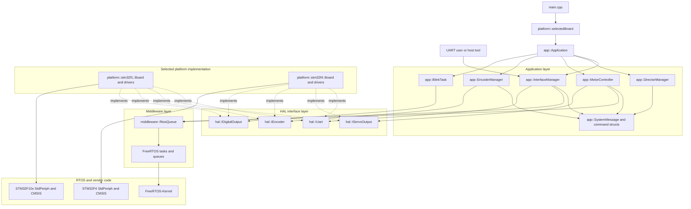
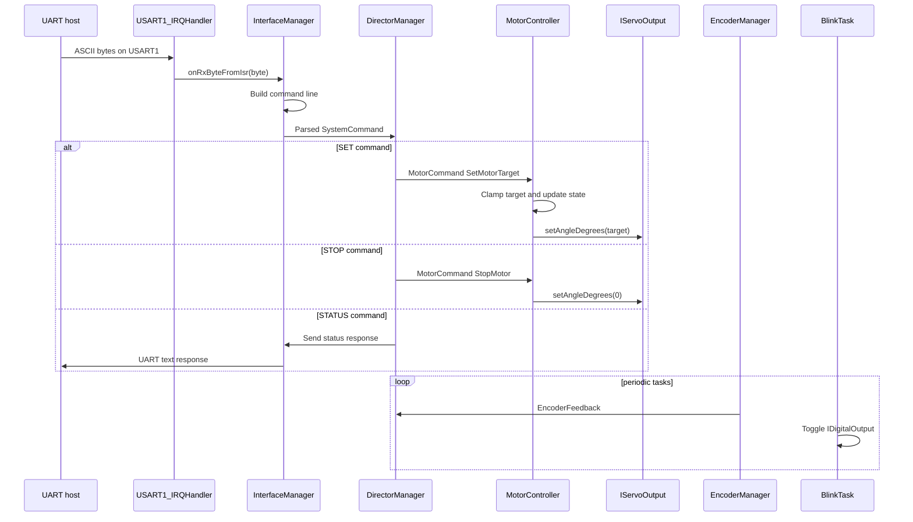
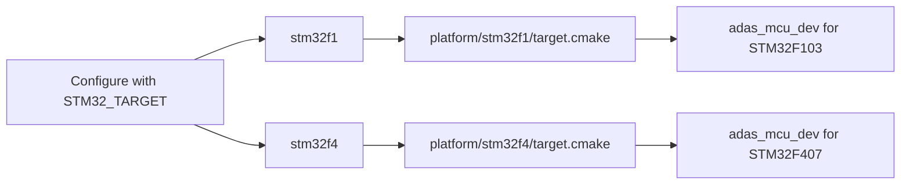

# STM32 RTOS C++ Architecture

## Layers

The firmware is now split into explicit ownership layers:

| Layer | Folder | Responsibility |
| --- | --- | --- |
| Application | `include/app`, `src/app` | RTOS tasks, command parsing, system state, motor/encoder workflow |
| Middleware | `include/middleware` | Small FreeRTOS wrappers used by application classes |
| HAL interfaces | `include/hal` | C++ contracts for UART, servo/PWM, encoder, GPIO output, hardware components |
| Platform | `platform/stm32f1`, `platform/stm32f4` | Chip-specific startup, linker, StdPeriph/CMSIS setup, concrete peripheral drivers |
| RTOS/vendor | `FreeRTOS-Kernel`, `stm32f10x-stdperiph-lib`, `STM32F4_Driver` | Third-party kernel and STM32 vendor code |

Application classes use constructor injection and depend on `hal::` interfaces, not STM32 registers. Each board composes concrete drivers and application objects in its own `platform/<target>/board.cpp`.

## Architecture Diagrams

### Layered View



### Runtime Message Flow



### Build Target Selection



## Key Classes

| Class | Role |
| --- | --- |
| `app::Application` | Initializes managers and creates FreeRTOS tasks |
| `app::DirectorManager` | Owns system state, validates commands, routes motor commands |
| `app::InterfaceManager` | Owns UART RX queue, line parser, and responses |
| `app::MotorController` | Owns motor queue and servo output policy |
| `app::EncoderManager` | Samples encoder feedback and reports to Director |
| `app::BlinkTask` | Toggles the status LED through `hal::IDigitalOutput` |
| `platform::stm32f1::Board` | Wires STM32F1 drivers into the application graph |
| `platform::stm32f4::Board` | Wires STM32F407 drivers into the application graph |

## Adding Hardware

1. Add or reuse an interface in `include/hal`.
2. Implement the concrete driver in `platform/<target>`.
3. Compose the driver into that target's `Board`.
4. Pass the interface into the app class that needs it.

This keeps new peripherals out of `main.cpp` and avoids spreading chip-specific headers through application code.

## Multi-Target Build

Select the MCU family at configure time:

```bash
cmake -Bbuild \
  -DCMAKE_BUILD_TYPE=Debug \
  -DCMAKE_TOOLCHAIN_FILE=gcc-arm-none-eabi.cmake \
  -DSTM32_TARGET=stm32f1
cmake --build build
```

or with the Makefile:

```bash
make STM32_TARGET=stm32f1
make STM32_TARGET=stm32f4
```

`platform/stm32f1/target.cmake` provides the F103 configuration. `platform/stm32f4/target.cmake` provides the F407 configuration using the STM32F4 StdPeriph/CMSIS package and the `GCC_ARM_CM4F` FreeRTOS port.
